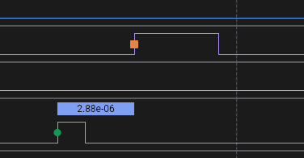
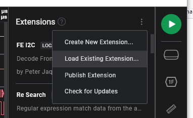

# TimeDelta - Saleae Logic Analyzer LLA

## Copyright &copy; 2023 ADInstruments

__*The code is provided "as is" without warranty of any kind.*__
ADInstruments __*does not warrant that the functions of the code will meet
your requirements, or that the operation of the code will be uninterrupted or
error-free, or that defects in it can be corrected.*__

---

## Description

TimeDelta measures the time from active edges on a reference input to active
edges on a target input. It is useful for tasks such as monitoring the
performance of a digital PLL or the response time of a system to an input event.

Active edges may be set independently for the reference and the target inputs to
be active rising or falling .



Reference edges are marked with a green circle. Target edges are marked with a
red square. The time between the two edges is shown in a text bubble above the
reference trace between the reference and target edges.

TimeDelta looks for the most recent reference edge before a target edge. Only
adjacent reference and target edges are paired up. Extra edges in either input
are skipped.

__Note that TimeDelta does not create sample data at present.__

## System Requirements

This software was written against Logic2 2.4.10 using the FrameV2 API. It should
work with Saleae Logic 2.3.43 and later.

Only the Windows build of the analyzer has been tested by the author. The author
is happy to accept pull requests to the
https://github.com/GrandFatherADI/TimeDelta repository submitted by users of
other platforms to address any OS specific issues found. General and Windows
specific issues may be raised using GitHub's normal Issues management facility.

## Installation

The fastest way to use this analyzer is to download a release from github at
https://github.com/GrandFatherADI/TimeDelta/actions. Click on the commit title
for the most recent release version (__V1.0.1__ for example), then at the bottom
of the "runs" page click on the Artifacts entry for your platform. This will
download a .zip file containing the extension file. Unzip this to a suitable
place on your system. Use the "Load Existing Extension..." dialog to point
Logic2 at the folder.



## Clone and build

If you wish the repository can be cloned and used to build TimeDelta locally.
CMake and a C++ compiler are required. Instructions for installing dependencies
can be found here: https://github.com/saleae/SampleAnalyzer. This repository
also includes more complete build instructions (especially for Mac) in
sample_readme.md than the build sysnopsis given below.

Once the repository has been cloned to your machine and tolls and dependencies
have been installed, from a command line navigate to the root folder of the
clone then follow the mantra below appropriate to your system.

### Windows

```bat
mkdir build
cd build
cmake .. -A x64
cmake --build .
:: built analyzer will be located at TimeDelta\build\Analyzers\Debug\TimeDeltaAnalyzer.dll
```

### MacOS

```bash
mkdir build
cd build
cmake ..
cmake --build .
# built analyzer will be located at TimeDelta/build/Analyzers/libTimeDeltaAnalyzer.so
```

### Linux

```bash
mkdir build
cd build
cmake ..
cmake --build .
# built analyzer will be located at TimeDelta/build/Analyzers/libTimeDeltaAnalyzer.so
```

## Related Documentation

For details on the Logic SDK's API please refer to the Saleae's
[Protocol Analyzer
SDK](https://support.saleae.com/saleae-api-and-sdk/protocol-analyzer-sdk) page.
